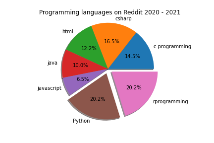
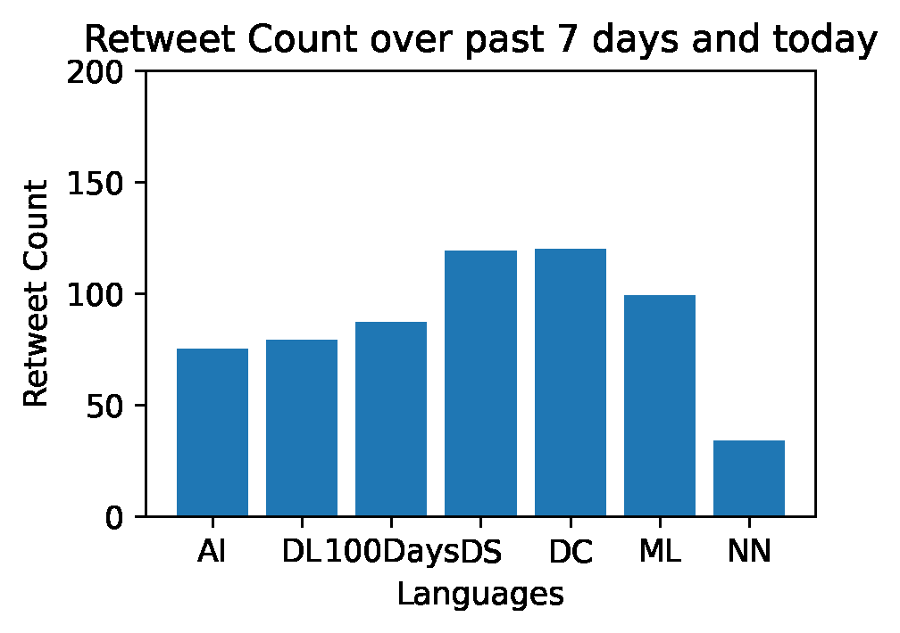

# TechSights

## 1.1 Crawler File Documentation

The crawlercode.py is inclusive of a parent abstract crawler class, several social media subclasses and testing unit class.
Similar to this markdown document, there are documentations in place for each class. It can be seen when you include help(classname) in the code.

To ensure it runs smoothly, ensure the following

1. Install python from <https://www.python.org/downloads/>
2. Run the scipt.sh file (includes the python libraries that needs to be downloaded)

OR

2. Manually download the python libraries

```console
pip install praw
pip install pandas
pip install seaborn
pip install matplotlib
pip install numpy
pip install textblob
pip install requests
pip install bs4
pip install schedule
pip install pytz
pip install tweepy
pip install datetime 
pip install schedule
```

---

### 1.1.1 Crawler Abstract class

---

This function is an abstract crawler class. It has the shared attributes defined within all the crawlers and abstract functions that will be defined properly in the individual subclasses.

### 1.1.1.1 __init__

Description:

This is where the attributes of the parent class is defined. It takes in the parameters required to initiate the crawler which is the topic and dataframe.
Self.data is empty as this is dependent on the aunthenticate functions in each subclass

Parameters:

self
topic(str): the topic/hashtag to be crawled
df(dataframe): empty dataframe for the crawler with only headers defined.

Returns:
None

### 1.1.1.2 crawldatatop

Description:

This is an abstract function that crawls the top data which is used by all the subclasses. This is left as abstract as each crawler sub class has different attributes that they crawl

### 1.1.1.3 crawldatatop

Description:

This is an abstract function that saves the dataframes into CSV. Naming convention is defined under each subclasses

### 1.1.1.4 authenticate

Description:

This is an abstract function to authenticate into each social media. However, not all crawlers require authentication hence this can be used for pulling html and saving to self.data

---

### 1.1.2 SubClass: Reddit Crawler

---

Parameter:

crawleddata(class): passes the parent class

### 1.1.2.1 authenticate

Description:

This functions authenticates into a valid reddit user with the specified id,secret,user_agent,username,password. The valid authentication is saved into the self.data attribute so that the whole session is authenticated by referring to this self.data

Parameters:
self

Returns:
self.data: returns the authenticated log in and saves into the self.data attribute

```Python
    #uses praw which is a Reddit API for crawling
    #https://www.reddit.com/prefs/app can be used to create your identification tokens
    self.data = praw.Reddit(client_id='1Wbphu7sZiWpfg', client_secret='8SiX9MqF6468B9-8zTNBbAr3AZiAMg',
                                user_agent='dengueapp', username='assignmentproj', password='Password123')
```

### 1.1.2.2 crawldatatop

Description:

This functions crawls the top reddit based on the self.topic that is specified during the creation of reddit instance. The crawled data is added to the originally empty dataframe based on the specified header.

Parameters:
self

Returns:
self.df: returns the updated dataframe with new crawled reddit entries

```Python
    subreddit = self.data.subreddit(self.topic)
    top_subreddit = subreddit.top()
    for submission in top_subreddit:
        #placing each submission details under the correct dataframe headers
        self.df = self.df.append({'Title': submission.title,
                        'Score':submission.score,
                        'ID':submission.id,
                       'URL':submission.url,
                       'Comms_num':submission.num_comments,
                       "Created":submission.created,
                       "Body":submission.selftext}, ignore_index=True)

```

### 1.1.2.3 crawldatasubtopic

Description:

This functions crawls the reddit subtopic within the specified self.topic that is specified during the creation of reddit instance. The crawled data is added to the originally empty dataframe based on the specified header. Not implemented for use but can be an alternative to crawldatatop, if a specific subtopic would like to crawled within the self.topic

Parameters:
self
subtopic(str): takes in the value of the subtopic within a topic

Returns:
self.df: returns the updated dataframe with new crawled reddit entries

### 1.1.2.4 getsentiment

Description:

This functions adds a new column to the dataframe named 'Sentiment'. The Sentiment will check on the polarity of the body.
A positive sentiment value = Positive Comment
Zero sentiment value = Nuetral Comment
A negative sentiment value = Negative Comment

Parameters:
self

Returns:
self.df: returns the updated dataframe with new crawled reddit entries

```Python
    #This line applies a function to the body column to get the polairty using the TextBlob libary and saves it into a new column called sentiment
    self.df['Sentiment'] = self.df['Body'].apply(lambda x: TextBlob(x).sentiment.polarity)
```

### 1.1.2.4 cleandata

Description:

This functions cleans up the dataframe by dropping irrelevant columns for easier analysis. It also creates 'Year' and 'Month' columns in case any time serieswould be used in the analysis.

Parameters:
self

Returns:
self.df: returns the updated dataframe with new crawled reddit entries

```Python
    def get_date(created):
        return dt.datetime.fromtimestamp(created)
    _timestamp = self.df["Created"].apply(get_date)
    self.df = self.df.assign(timestamp = _timestamp)
    #dropping columns that are not important for our analysis
    self.df = self.df.drop(['Created','Score','Comms_num'],axis=1)
    self.df['Year'] = pd.DatetimeIndex(self.df['timestamp']).year
    self.df['Month'] = pd.DatetimeIndex(self.df['timestamp']).month
```

### 1.1.2.4 saveCV

Description:
This functions saves the dataframes into csv for use for analysis and for the front end. Local file storage is used as the program's database. It saves it in respective folders, if folder is not found, it will create a folder.

Parameters:
self

Returns:
None

```Python
    if not os.path.exists('reddit'):
        os.makedirs('reddit')
    self.df.to_csv("reddit/reddit-" + self.topic + ".csv")
```

---

### 1.1.3 SubClass: Stack Crawler

---
Parameters:
crawleddata(class): passes the parent class

### 1.1.3.1 authenticate

Description:

Stack does not need proper authentication.
This functions uses beautifulsoup4 to get the whole html page and save the data into self.data.

Parameters:
self

Returns:
self.data: returns the authenticated log in and saves into the self.data attribute

```Python
    #uses bs4 library to crawl the contents of the page
    site = requests.get('https://stackoverflow.com/questions/tagged/'+self.topic); 
    #soup holds the whole html that is crawled from bs4
    soup = BeautifulSoup(site.text,"html.parser")
    self.data = soup.select(".question-summary")
```

### 1.1.3.2 crawldatatop

Description:

This function seperates each entry within the whole html in self.data and splits it into the different rows and columns of the dataframe. The crawled data is added to the originally empty dataframe based on the specified header.

Parameters:
self

Returns:
self.df: returns the updated dataframe with new crawled stack entries

### 1.1.3.3 voterank

Description:
This function ranks the stack overflow entries based on the popularity of the views

Parameters:
self

Returns:
self.df: returns the updated dataframe with new crawled stack entries

```Python
    #A function is applied to the view column to change it to numeric from string and then sorted to base on popularity
    self.df["Views"]= self.df['Views'].apply(lambda x: x[:2])
    self.df["Views"] = pd.to_numeric(self.df["Views"])
    self.df = self.df.sort_values(by='Views', ascending=False)
```

### 1.1.3.4 saveCV

Description:

This functions saves the dataframes into csv for use for analysis and for the front end.
Local file storage is used as the program's database.
It saves it in respective folders, if folder is not found, it will create a folder.

Parameters:
self

Returns:
None

---

### 1.1.4 SubClass: GitHub Crawler

---

Parameters:
crawleddata(class): passes the parent class

### 1.1.4.1 authenticate

Description:

This functions authenticates into a valid stack overflow user with the specified access token. The valid authentication is saved into the self.data attribute so that the whole session is authenticated by referring to this self.data

Parameters:
self

Returns:
self.data: returns the authenticated log in and saves into the self.data attribute.

```Python
    def authenticate(self):
        self.data = "access_token=" + "cf0ff99540fe22c93255d736e3bed3bbfa10e17d"
        return self.data
```

### 1.1.4.2 crawldatatop

Description:

This functions crawls the git hub entries based on the self.topic that is specified during the creation of github instance.
The crawled data is added to the originally empty dataframe based on the specified header.
Another column is created as well: Other Programming Languages URL to access all the languages present in the repository
Calculation for the percentage of all the languages present in the repository is also done.

Parameters:
self

Returns:
self.df: returns the updated dataframe with new crawled reddit entries

```Python
def crawldatatop(self):
        #Range is set to 2 to shorten the search result
        for page in range(1, 2):
            #Building the Search API URL
            searchUrl = 'https://api.github.com/' + 'search/repositories?q=' + self.topic + '&page=' + str(page) + '&' + self.data

            #Get the requested searchURL
            response = requests.get(searchUrl).json()

            #Parse through the response of the searchQuery
            for item in response['items']:
                repository_name = item['name']
                repository_description = item['description']
                repository_stars = item['stargazers_count']
                repository_programming_language = item['language']
                repository_url = item['html_url']

                #Other Programming Languages URL to access all the languages present in the repository
                programming_language_url = item['url'] + '/languages?' + self.data
                programming_language_response = requests.get(programming_language_url).json()

                repository_other_languages = {}

                self.df = self.df.append({'Repository Name': repository_name, 'Description': repository_description,
                                 'Stars': repository_stars, 'Programming Language': repository_programming_language,
                                  'Other Language': repository_other_languages, 'URL': repository_url}, ignore_index=True)

                #Calculation for the percentage of all the languages present in the repository
                count_value = sum([value for value in programming_language_response.values()])
                for key, value in programming_language_response.items():
                    key_value = round((value / count_value) * 100, 2)
                    repository_other_languages[key] = key_value
        return self.df
```

### 1.1.4.3 saveCV

Description:
This functions saves the dataframes into csv for use for analysis and for the front end.
Local file storage is used as the program's database.
It saves it in respective folders, if folder is not found, it will create a folder.

Parameters:
self

Returns:
None

```Python
def saveCV(self):
        if not os.path.exists('github'):
            os.makedirs('github')
        self.df.to_csv("github/github-" + self.topic + ".csv")
```

---

### 1.1.5 SubClass: Twitter Crawler

---

Parameters:
crawleddata(class): passes the parent class

### 1.1.5.1 authenticate

Description:

This functions authenticates into a valid twitter user with the specified Handler and access token.
The valid authentication is saved into the self.data attribute so that the whole session is authenticated by referring to this self.data

Parameters:
self

Returns:
self.data: returns the authenticated log in and saves into the self.data attribute

```Python
def authenticate(self):
        auth = tweepy.OAuthHandler(
            "f9HugoUFnLlKdU4b6N2SFu8Ae",
            "zh7O2DYDdA4JN1Xe70PMaoHpslWQbNZnxsQzYRAUMx8LyuLb30",
        )
        auth.set_access_token(
            "1358278817085681665-szJPAYiD5uzRPyXDYamFnuwh2I2qoI",
            "fEh0d8l2b9kcL8jacPnVSRkleHAK30FS82spLYKSnCtKB",
        )

        # initialize Tweepy API
        self.data = tweepy.API(auth)
        return self.data
```

### 1.1.5.2 crawldatatop

Description:
This function crawls the top tweets that matches the hashtag (self.topic) by retrieve tweets up to 7 days ago and placing it in df in ascending order based on retweet count and favourite count.
The crawled data is added to the originally empty dataframe based on the specified header.

Parameters:
self

Returns:
self.df: returns the updated dataframe with new crawled twitter entries

```Python
def crawldatatop(self):
        # change createdAt from UTC to GMT+8
        timezone = pytz.timezone("Singapore")
        dateto = datetime.date.today()
        # for each tweet matching our hashtags, write relevant info to the spreadsheet
        for dayinput in range(-1, 7):
            for tweet in tweepy.Cursor(
                self.data.search,
                count=10,
                q=self.topic + "-filter:retweets",
                lang="en",
                until=dateto - timedelta(dayinput),
                include_entities=True,
                wait_on_rate_limit=True,
                tweet_mode="extended",
            ).items(10):
                if tweet.favorite_count != 0 and tweet.retweet_count != 0:
                    url = f"https://twitter.com/{tweet.user.screen_name}/status/{tweet.id}"
                    self.df = self.df.append(
                        {
                            "Tweet Content": tweet.full_text,
                            "User Name": tweet.user.screen_name,
                            "HashTags": [
                                e["text"] for e in tweet._json["entities"]["hashtags"]
                            ],
                            "Retweet Count": tweet.retweet_count,
                            "Favourite Count": tweet.favorite_count,
                            "URL": url,
                            "Created Date": tweet.created_at.date(),
                        },
                        ignore_index=True,
                    ).sort_values(
                        by=["Retweet Count", "Favourite Count"],
                        ascending=[False, False],
                    )
        return self.df
```

### 1.1.5.3 crawldatarecent

Description:

This function crawls the recent tweets that matches the hashtag (self.topic). The crawled data is added to the originally empty dataframe based on the specified header.

Parameters:
self

Returns:
self.df: returns the updated dataframe with new crawled twitter entries

```Python
def crawldatarecent(self):
        # for each tweet matching our hashtags, write relevant info to the spreadsheet
        for tweet in tweepy.Cursor(
            self.data.search,
            q=self.topic + " -filter:retweets",
            lang="en",
            wait_on_rate_limit=True,
            tweet_mode="extended",
        ).items(100):
            url = f"https://twitter.com/{tweet.user.screen_name}/status/{tweet.id}"
            self.df = self.df.append(
                {
                    "Tweet Content": tweet.full_text,
                    "User Name": tweet.user.screen_name,
                    "HashTags": [
                        e["text"] for e in tweet._json["entities"]["hashtags"]
                    ],
                    "Retweet Count": tweet.retweet_count,
                    "Favourite Count": tweet.favorite_count,
                    "URL": url,
                },
                ignore_index=True,
            )
        return self.df
```

### 1.1.5.4 saveCV

Description:
This functions saves the dataframes into csv for use for analysis and for the front end.
Local file storage is used as the program's database.
It saves it in respective folders path, if folder is not found, it will create a folder.

Parameters:
self

Returns:
None

---

```Python
def saveCV(self, name):
        if not os.path.exists('twitter'):
            os.makedirs('twitter')
        if name == "r":
            if not os.path.exists('twitter/recentpost'):
                os.makedirs('twitter/recentpost')
            fname = "_".join(re.findall(r"#(\w+)",self.topic))
            self.df.to_csv("twitter/recentpost/twitter_recent_" + fname+".csv")
        else:
            if not os.path.exists('twitter/toppost'):
                os.makedirs('twitter/toppost')
            fname = "_".join(re.findall(r"#(\w+)",self.topic))
            self.df.to_csv("twitter/toppost/twitter_top_" + fname+".csv")
```

### 1.1.6 Test Cases

---

This class has all the functions that performs unit testing. Unit testing is done to ensure program runs smoothly with no loopholes.

### 1.1.6.1 Test Case 1

Description:

Test if crawl time is float value & if subtraction method is correct

```Python
def testCase1 (self):
        test = endTime - startTime
        
        if test == float and test == result:
            #assertTrue() to check true of test value
            self.assertTrue(test)
    
```

### 1.1.6.2 Test Case 2

Description:

Test if crawl time is lesser than 5 minutes

```Python
 def testCase2(self):
        value1 = result
        value2 = 300
        
        #Error message in case if test case got failed 
        msg = "Crawl time is more than 5 minutes"
        
        #assert function() to check if values1 is less than value2 
        self.assertLess(value1, value2, msg) 
```

### 1.1.6.3 Test Case 3

Description:

Test if CSV file is created and stored in os.path

```Python
 def testCase3(self):
        program = ['c_programming',"Python", "csharp", "javascript","html", "java","rprogramming"]
        
        for i in program:
            self.assertTrue(os.path.exists('reddit/reddit-' + i + '.csv'), "File does not exist!")
            self.assertTrue(os.path.exists('stackoverflow/stackoverflow-' + i + '.csv'), "File does not exist!")
            self.assertTrue(os.path.exists('github/github-' + i + '.csv'), "File does not exist!")
        
        twit = ["#ArtificialIntelligence", "#MachineLearning", "#DeepLearning", "#NeuralNetwork", "#DataScience",
                "#100DaysOfCode", "#DEVCommunity"]
        
        for t in twit:
            store = "_".join(re.findall(r"#(\w+)", t))
            #self.assertTrue(os.path.exists('twitter/recentpost/twitter_recent_' + store + '.csv'), "File does not exist!")
            self.assertTrue(os.path.exists('twitter/toppost/twitter_top_' + store + '.csv'), "File does not exist!")

```

### 1.1.6.3 Test Case 4

Description:

Test if folder contain correct number of files crawled

```Python
def testCase4(self):
        expectedfiles=7
        # dir is your directory path
        list2=os.listdir("reddit")
        number_files2 = len(list2)
        self.assertEqual(number_files2,expectedfiles,'Number of files inserted not equal to 7 for reddit')
        
        list3=os.listdir("stackoverflow")
        number_files3 = len(list3)
        self.assertEqual(number_files3,expectedfiles,'Number of files inserted not equal to 7 for stackoverflow')
        
        list4=os.listdir("github")
        number_files4 = len(list4)
        self.assertEqual(number_files4,expectedfiles,'Number of files inserted not equal to 7 for github')
        
        onlyfiles1 = next(os.walk("twitter/recentpost"))[2] #dir is your directory path as string
        number_files1=len(onlyfiles1)
        self.assertEqual(number_files1,expectedfiles,'Number of files inserted not equal to 7 for twitter recent')
        
        onlyfiles = next(os.walk("twitter/toppost"))[2] #dir is your directory path as string
        number_files5=len(onlyfiles)
        self.assertEqual(number_files5,expectedfiles,'Number of files inserted not equal to 7 for twitter top')
```

---

### 1.1.6 Task

---

Description:

This function is made to allow main function to be clean. Hence, all the task that needs to be run is within this class and function.
Dataframe for each crawler is predefined here.
Array of topics to be crawled is also defined here.
Instances of each crawler objects are defined here as well.

```Python
    df = pd.DataFrame(columns=['Title','Score','ID','URL','Comms_num','Created','Body'])
    df1 = pd.DataFrame(columns=['Title','URL','Views','Votes'])
    df3 = pd.DataFrame(columns=['Repository Name', 'Description', 'Stars','Programming Language', 'Other Language', 'URL'])
    df4 = pd.DataFrame(columns=['Tweet Content','User Name','HashTags','Retweet Count','Favourite Count','URL'])
    df5 = pd.DataFrame(columns=['Tweet Content','User Name','HashTags','Retweet Count','Favourite Count','URL','Created Date'])

    #enquiring languages
    languages = ['c_programming',"Python", "csharp", "javascript","html", "java","rprogramming"]


    print(crawledreddit.authenticate.__doc__)

    for i in languages:
        stackoverflow = stack(i,df1)
        stackoverflow.authenticate()
        stackoverflow.crawldatatop()
        stackoverflow.voterank()
        stackoverflow.saveCV()
    print("Stack has been crawled!")

    for i in languages:

        redditdata = crawledreddit(i,df)
        redditdata.authenticate()
        redditdata.crawldatatop()
        redditdata.cleandata()
        redditdata.getsentiment()
        redditdata.saveCV()
    print("Reddit has been crawled!")


    for i in languages:
        github = crawledgithub(i,df3)
        github.authenticate()
        github.crawldatatop()
        github.saveCV()
    print("Github has been crawled!") 
    #enquiring trends

    trends = [
        "#ArtificialIntelligence",
        "#MachineLearning",
        "#DeepLearning",
        "#NeuralNetwork",
        "#DataScience",
        "#100DaysOfCode",
        "#DEVCommunity",
    ]

    #for recent tweets
    for i in trends:
        recenttweets = crawledtwitter(i,df4)
        recenttweets.authenticate()
        recenttweets.crawldatarecent()
        recenttweets.saveCV("r")
    print("Recent tweets has been crawled!")
     #for top tweets
    for i in trends:
        recenttweets = crawledtwitter(i,df5)
        recenttweets.authenticate()
        recenttweets.crawldatatop()
        recenttweets.saveCV("t")
    print("Top tweets has been crawled!")
```

---

### 1.1.7 Main Program

---

The main program starts the timer and call the task class to run the various crawlers. Scheduler is also tasked to run the program every 1 minute.

---

### 2.0 jupyter notebook file

---

To run data analytic jupyter notebook file:

1) Download anaconda

2) Open jupyter notebook by typing "jupyter notebook"

3) Install pip Matplotlib in anaconda prompt(terminal)

4) Install numpy, pandas, schedule using pip the same as step 3

5) Run the file by: cell -> run all

Make sure that the .ipynb is in the same folder as their respective csvs.

---

## 2.1 Github - Piechart

---
This function is to plot a piechart for github

---

### 2.1.1 Github - import libraries

---
This function is to import libraries required and specify file path

---

```Python
#Import libraries
import numpy as np
import pandas as pd
from matplotlib import pyplot as plt
import schedule
import time
import unittest
import os
import glob

path = r'C:\Users\yc\Downloads\Uni Application\SIT\TRI 2\1009\Project\github' # location whr data is saved


```
### 2.1.2 Github - Test cases

---
This function is for test cases

---

```Python
class testCases(unittest.TestCase):
    #Test if crawl time is float value & if subtraction method is correct
    def testCase1 (self):
        test = endTime - startTime
        
        if test == float and test == result:
            #assertTrue() to check true of test value
            self.assertTrue(test)
            
    #Test if crawl time is lesser than 1 minutes
    def testCase2(self): 
        value1 = result
        value2 = 60
        
        #Error message in case if test case got failed 
        msg = "Crawl time is more than 1 minutes"
        
        #assert function() to check if values1 is less than value2 
        self.assertLess(value1, value2, msg) 
        
     #Test if csv file is empty
    def testcase3(self):
        df1 = pd.read_csv('github-c_programming.csv') #Read csv
        df1.empty  #check if empty
        if df1.empty == True:
            print("The c programming csv file is empty")
        else:
            print("The c programming csv file has data")
            
        df2 = pd.read_csv('github-csharp.csv')  #Read csv
        df2.empty  #check if empty
        if df2.empty == True:
            print("The csharp csv file is empty")  
        else:
            print("The csharp csv file has data")
            
        df3 = pd.read_csv('github-html.csv')  #Read csv
        df3.empty  #check if empty
        if df3.empty == True:
            print("The html csv file is empty")
        else:
            print("The html csv file has data")
            
        df4 = pd.read_csv('github-java.csv')   #Read csv
        df4.empty  #check if empty
        if df4.empty == True:
            print("The java csv file is empty")
        else:
            print("The java csv file has data")
            
        df5 = pd.read_csv('github-javascript.csv')  #Read csv
        df5.empty  #check if empty
        if df5.empty == True:
            print("The javascript csv file is empty")
        else:
            print("The javascript csv file has data")
            
        df6 = pd.read_csv('github-Python.csv')  #Read csv
        df6.empty  #check if empty
        if df6.empty == True:
            print("The Python csv file is empty")
        else:
            print("The Python csv file has data")
              
        df7 = pd.read_csv('github-rprogramming.csv')  #Read csv
        df7.empty  #check if empty
        if df7.empty == True:
            print("The rprogramming csv file is empty")
        else:
            print("The rprogramming csv file has data")
            
    #Test if graph is created and exported as png
    def testcase4(self):
        picture = os.path.isfile('github_topicpopularity.png')
        if picture == True:
            print("The graph is created")
        else:
            print("The graph is not created")
            
    #Test the number of csv found in folder 
    def testCase5(self):
        expectedfiles=7
        # dir is your directory path 
        list2=os.listdir(path)
        
        number_files2 = len(glob.glob('./*.csv'))
        self.assertEqual(number_files2,expectedfiles,'Number of csv found is not equal to 7 for stackoverflow')

```

### 2.1.3 Github - get data required

---
This function is to read data in csvs and get sum of vote

---

```Python
def data():
    #sum of vote in github-c_programming.csv
    data1 = pd.read_csv('github-c_programming.csv')
    ctotal = data1['Stars'].sum()

    #sum of vote in github-csharp.csv
    data2 = pd.read_csv('github-csharp.csv')
    csharptotal = data2['Stars'].sum()


    #sum of vote in github-html.csv
    data3 = pd.read_csv('github-html.csv')
    htmltotal = data3['Stars'].sum()

    #sum of vote in github-java.csv
    data4 = pd.read_csv('github-java.csv')
    javatotal = data4['Stars'].sum()

    #sum of vote in github-javascript.csv
    data5 = pd.read_csv('github-javascript.csv')
    jstotal = data5['Stars'].sum()
    

    #sum of vote in github-Python.csv
    data6 = pd.read_csv('github-Python.csv')
    pythontotal = data6['Stars'].sum()
    

    #sum of vote in rprogramming.csv
    data7 = pd.read_csv('github-rprogramming.csv')
    rtotal = data7['Stars'].sum()
    graph(ctotal,csharptotal,htmltotal,javatotal,jstotal,pythontotal,rtotal)

```

### 2.1.4 Github - plot graph

---
This function is to plot pie chart

---

```Python
#Plot pie chart with object oriented interface
def graph(ctotal,csharptotal,htmltotal,javatotal,jstotal,pythontotal,rtotal):
    my_data=[ctotal,csharptotal,htmltotal,javatotal,jstotal,pythontotal,rtotal]
    my_labels='cprogramming','c#','html','java','javascript','python','rprogramming'
    explode = (0, 0, 0, 0.1, 0, 0, 0)  # only "explode" java
    
    fig1, ax1 = plt.subplots()
    ax1.set_title('Topic popularity on Github')
    ax1.pie(my_data, explode=explode, labels=my_labels, autopct='%1.1f%%',shadow=True)
    ax1.axis('equal')  # Equal aspect ratio ensures that pie is drawn as a circle.
    
    plt.show()
    fig1.savefig('github_topicpopularity.png')
```

### 2.1.5 Github - Scheduler

---
This function is to schedule pie chart to update

---

```Python
#Scheduler
if __name__ == "__main__":
    startTime = time.perf_counter()
    data()       
    endTime = time.perf_counter()
    result = endTime - startTime
    print (f"Total time taken to plot graph is {result:0.4f} seconds!")
    unittest.main(argv=['first-arg-is-ignored'], exit=False)
    schedule.every(1).minutes.do(data)

    while True:
        schedule.run_pending()
        time.sleep(1)
```

## 3.1 Reddit - Piechart

This function is to plot a piechart for Reddit

---

### 3.1.1 Reddit - import libraries

---
This function is to import libraries required and specify file path

---

```Python
#Import libraries
import numpy as np
import pandas as pd
from matplotlib import pyplot as plt
import schedule
import time
import unittest
import os
import glob

#File location
path = r'C:\Users\yc\Downloads\Uni Application\SIT\TRI 2\1009\Reddit' 
```

### 3.1.2 Reddit - Test case

---
This function is for test cases

---

```Python
class testCases(unittest.TestCase):
    #Test if crawl time is float value & if subtraction method is correct
    def testCase1 (self):
        test = endTime - startTime
        
        if test == float and test == result:
            #assertTrue() to check true of test value
            self.assertTrue(test)
            
    #Test if crawl time is lesser than 1 minutes
    def testCase2(self): 
        value1 = result
        value2 = 60
        
        #Error message in case if test case got failed 
        msg = "Crawl time is more than 1 minutes"
        
        #assert function() to check if values1 is less than value2 
        self.assertLess(value1, value2, msg) 
        
     #Test if csv file is empty
    def testcase3(self):
        df1 = pd.read_csv('reddit-c_programming.csv') #Read csv
        df1.empty  #check if empty
        if df1.empty == True:
            print("The c programming csv file is empty")
        else:
            print("The c programming csv file has data")
            
        df2 = pd.read_csv('reddit-csharp.csv')  #Read csv
        df2.empty  #check if empty
        if df2.empty == True:
            print("The csharp csv file is empty")  
        else:
            print("The csharp csv file has data")  
            
        df3 = pd.read_csv('reddit-html.csv')  #Read csv
        df3.empty  #check if empty
        if df3.empty == True:
            print("The html csv file is empty")
        else:
            print("The html csv file has data")
            
        df4 = pd.read_csv('reddit-java.csv')  #Read csv
        df4.empty  #check if empty
        if df4.empty == True:
            print("The java csv file is empty")
        else:
            print("The java csv file has data")
            
        df5 = pd.read_csv('reddit-javascript.csv')  #Read csv
        df5.empty  #check if empty
        if df5.empty == True:
            print("The javascript csv file is empty")
        else:
            print("The javascript csv file has data")
            
        df6 = pd.read_csv('reddit-Python.csv')  #Read csv
        df6.empty  #check if empty
        if df6.empty == True:
            print("The Python csv file is empty")
        else:
            print("The Python csv file has data")
            
        df7 = pd.read_csv('reddit-rprogramming.csv')  #Read csv
        df7.empty  #check if empty
        if df7.empty == True:
            print("The rprogramming csv file is empty")
        else:
            print("The rprogramming csv file has data")
            
    #Test if graph is created and exported as png
    def testcase4(self):
        picture = os.path.isfile('reddit_prglanguage.png')
        if picture == True:
            print("The graph is created")
        else:
            print("The graph is not created")
            
    #Test the number of csv found in folder 
    def testCase5(self):
        expectedfiles=7
        # dir is your directory path 
        list2=os.listdir(path)
        
        number_files2 = len(glob.glob('./*.csv'))
        self.assertEqual(number_files2,expectedfiles,'Number of csv found is not equal to 7 for stackoverflow')

```

### 3.1.3 Reddit - get data required

---
This function is to read data in csvs and get no. of row

---

```Python
def data():    
    #number of rows in c_programming csv
    data1 = pd.read_csv('reddit-c_programming.csv')
    data_year=data1.loc[data1['Year'] >= 2020]
    index1=data_year.index
    num1 = len(index1) 

    #number of rows in csharp csv
    data2 = pd.read_csv('reddit-csharp.csv')
    data_year2=data2.loc[data2['Year'] >= 2020]
    index2=data_year2.index
    num2 = len(index2) 

    #number of rows in html csv
    data3 = pd.read_csv('reddit-html.csv')
    data_year3=data3.loc[data3['Year'] >= 2020]
    index3=data_year3.index
    num3 = len(index3)

    #number of rows in java csv
    data4 = pd.read_csv('reddit-java.csv')
    data_year4=data4.loc[data4['Year'] >= 2020]
    index4=data_year4.index
    num4 = len(index4)

    #number of rows in javascript csv
    data5 = pd.read_csv('reddit-javascript.csv')
    data_year5=data5.loc[data5['Year'] >= 2020]
    index5=data_year5.index
    num5 = len(index5)

    #number of rows in Python csv
    data6 = pd.read_csv('reddit-Python.csv')
    data_year6=data6.loc[data6['Year'] >= 2020]
    index6=data_year6.index
    num6 = len(index6)

    #number of rows in rprogramming csv
    data7 = pd.read_csv('reddit-rprogramming.csv')
    data_year7=data7.loc[data7['Year'] >= 2020]
    index7=data_year7.index
    num7 = len(index7)

    graph(num1,num2,num3,num4,num5,num6,num7)
    
    
```

### 3.1.4 Reddit - plot graph

---
This function is to plot pie chart

---

```Python
#Plot pie chart with object oriented interface
def graph(num1,num2,num3,num4,num5,num6,num7):
    my_data=[num1,num2,num3,num4,num5,num6,num7]
    my_labels='c programming','csharp','html','java','javascript','Python','rprogramming'

    explode = (0, 0, 0, 0, 0, 0.1, 0.1)  # only "explode" python and r programming
    
    fig1, ax1 = plt.subplots()
    ax1.set_title('Programming languages on Reddit 2020 - 2021')
    ax1.pie(my_data, explode=explode, labels=my_labels, autopct='%1.1f%%',shadow=True)
    ax1.axis('equal')  # Equal aspect ratio ensures that pie is drawn as a circle.
    
    plt.show()
    fig1.savefig('reddit_prglanguage.png')
```

### 3.1.5 Reddit - Scheduler

---
This function is to schedule pie chart to update

---

```Python
#Scheduler
if __name__ == "__main__":
    startTime = time.perf_counter()
    data()       
    endTime = time.perf_counter()
    result = endTime - startTime
    print (f"Total time taken to plot graph is {result:0.4f} seconds!")
    unittest.main(argv=['first-arg-is-ignored'], exit=False)
    schedule.every(1).minutes.do(data)

    while True:
        schedule.run_pending()
        time.sleep(1)
```

## 4.1 Stackoverflow - Piechart

---
This function is to plot a piechart for stackoverflow

---

### 4.1.1 Stackoverflow - import libraries

---
This function is to import libraries required and specify file path

---

```Python
#Import libraries
import numpy as np
import pandas as pd
from matplotlib import pyplot as plt
import schedule
import time
import unittest
import os
import glob

#file path
path = r'C:\Users\yc\Downloads\Uni Application\SIT\TRI 2\1009\Project\stackoverflow' # location whr data is saved


```

### 4.1.2 Stackoverflow - Test cases

---
This function is for test cases

---

```Python
class testCases(unittest.TestCase):
    #Test if crawl time is float value & if subtraction method is correct
    def testCase1 (self):
        test = endTime - startTime
        
        if test == float and test == result:
            #assertTrue() to check true of test value
            self.assertTrue(test)
            
    #Test if crawl time is lesser than 1 minutes
    def testCase2(self): 
        value1 = result
        value2 = 60
        
        #Error message in case if test case got failed 
        msg = "Crawl time is more than 1 minutes"
        
        #assert function() to check if values1 is less than value2 
        self.assertLess(value1, value2, msg) 
        
     #Test if csv file is empty
    def testcase3(self):
        df1 = pd.read_csv('stackoverflow-c_programming.csv') #read csv
        df1.empty #check if empty
        if df1.empty == True:
            print("The c programming csv file is empty")
        else:
            print("The c programming csv file has data")
            
        df2 = pd.read_csv('stackoverflow-csharp.csv')   #read csv
        df2.empty  #check if empty
        if df2.empty == True:
            print("The c sharp csv file is empty")  
        else:
            print("The c sharp csv file has data")
            
        df3 = pd.read_csv('stackoverflow-html.csv')#read csv
        df3.empty  #check if empty
        if df3.empty == True:
            print("The html csv file is empty")
        else:
            print("The html csv file has data")
            
        df4 = pd.read_csv('stackoverflow-java.csv')  #read csv
        df4.empty  #check if empty
        if df4.empty == True:
            print("The java csv file is empty")
        else:
            print("The java csv file has data")
            
        df5 = pd.read_csv('stackoverflow-javascript.csv')  #read csv
        df5.empty  #check if empty
        if df5.empty == True:
            print("The javascript csv file is empty")
        else:
            print("The javascript csv file has data")
            
        df6 = pd.read_csv('stackoverflow-Python.csv')  #read csv
        df6.empty  #check if empty
        if df6.empty == True:
            print("The python csv file is empty")
        else:
            print("The python csv file has data")
            
        df7 = pd.read_csv('stackoverflow-rprogramming.csv')  #read csv
        df7.empty  #check if empty
        if df7.empty == True:
            print("The r programming csv file is empty")
        else:
            print("The r programming csv file has data")
            
    #Test if graph is created and exported as png
    def testcase4(self):
        picture = os.path.isfile('stackoverflow_prglanguages.png')
        if picture == True:
            print("The graph is created")
        else:
            print("The graph is not created")
            
    #Test the number of csv found in folder 
    def testCase5(self):
        expectedfiles=7
        # dir is your directory path
        list2=os.listdir(path)
        
        number_files2 = len(glob.glob('./*.csv'))
        self.assertEqual(number_files2,expectedfiles,'Number of csv found is not equal to 7 for stackoverflow')

```

### 4.1.3 Stackoverflow - get data required

---
This function is to read data in csvs and get sum of view

---

```Python
 def data():
    
    #sum of view in stackoverflow1-c csv
    data1 = pd.read_csv('stackoverflow-c_programming.csv')
    ctotal = data1['Views'].sum()
    
    #sum of view in stackoverflow1-csharp csv
    data2 = pd.read_csv('stackoverflow-csharp.csv')
    csharptotal = data2['Views'].sum()


    #sum of view in stackoverflow1-html.csv
    data3 = pd.read_csv('stackoverflow-html.csv')
    htmltotal = data3['Views'].sum()


    #sum of view in stackoverflow1-java.csv
    data4 = pd.read_csv('stackoverflow-java.csv')
    javatotal = data4['Views'].sum()


    #sum of view in stackoverflow1-javascript.csv
    data5 = pd.read_csv('stackoverflow-javascript.csv')
    jstotal = data5['Views'].sum()
    

    #sum of view in stackoverflow1-Python.csv
    data6 = pd.read_csv('stackoverflow-Python.csv')
    pythontotal = data6['Views'].sum()


    #sum of view in stackoverflow1-rprogramming.csv
    data7 = pd.read_csv('stackoverflow-rprogramming.csv')
    rtotal = data7['Views'].sum()
    
    graph(csharptotal,htmltotal,javatotal,ctotal,jstotal,pythontotal,rtotal)
    
```

### 4.1.4 Stackoverflow - plot graph

---
This function is to plot pie chart

---

```Python
#Plot piechart with object oriented interface
def graph(csharptotal,htmltotal,javatotal,ctotal,jstotal,pythontotal,rtotal):
#Plot pie chart
    my_data=[csharptotal,htmltotal,javatotal,ctotal,jstotal,pythontotal,rtotal]
    my_labels='csharp','html','java','cprogramming','javascript','python','rprogramming'
    
    explode = (0, 0.1, 0, 0, 0, 0, 0)  # only "explode" html
    
    fig1, ax1 = plt.subplots()
    ax1.set_title('Programming languages view count on stackoverflow')
    ax1.pie(my_data, explode=explode, labels=my_labels, autopct='%1.1f%%',shadow=True)
    ax1.axis('equal')  # Equal aspect ratio ensures that pie is drawn as a circle.
    
    plt.show()
    fig1.savefig('stackoverflow_prglanguages.png')
```

### 6.1.5 Stackoverflow - Scheduler

---
This function is to schedule pie chart to update

---

```Python
#Scheduler
if __name__ == "__main__":
    startTime = time.perf_counter()
    data()       
    endTime = time.perf_counter()
    result = endTime - startTime
    print (f"Total time taken to plot graph is {result:0.4f} seconds!")
    unittest.main(argv=['first-arg-is-ignored'], exit=False)
    schedule.every(1).minutes.do(data)

    while True:
        schedule.run_pending()
        time.sleep(1)
```

## 7.1 Twitter - Piechart

---
This function is to plot a piechart for Twitter

---

### 7.1.1 Twitter - import libraries

---
This function is to import libraries required and specify file path

---

```Python
#Import libraries
import numpy as np
import pandas as pd
from matplotlib import pyplot as plt
import schedule
import time
import unittest
import os
import glob

#File path
path = r'C:\Users\yc\Downloads\Uni Application\SIT\TRI 2\1009\Project\twitter' # location whr data is saved


```

### 7.1.2 Twitter - Test cases

---
This function is for test cases

---

```Python
class testCases(unittest.TestCase):
    #Test if crawl time is float value & if subtraction method is correct
    def testCase1 (self):
        test = endTime - startTime
        
        if test == float and test == result:
            #assertTrue() to check true of test value
            self.assertTrue(test)
            
    #Test if crawl time is lesser than 1 minutes
    def testCase2(self): 
        value1 = result
        value2 = 60
        
        #Error message in case if test case got failed 
        msg = "Crawl time is more than 1 minutes"
        
        #assert function() to check if values1 is less than value2 
        self.assertLess(value1, value2, msg) 
        
     #Test if csv file is empty
    def testcase3(self):
        df1 = pd.read_csv('twitter_top_ArtificialIntelligence.csv')  #Read csv
        df1.empty  #Check if empty
        if df1.empty == True:
            print("The ArtificialIntelligence csv file is empty")
        else:
            print("The ArtificialIntelligence csv file has data")
            
        df2 = pd.read_csv('twitter_top_DeepLearning.csv')  #Read csv
        df2.empty  #Check if empty
        if df2.empty == True:
            print("The DeepLearning csv file is empty")  
        else:
            print("The DeepLearning csv file has data")
            
        df3 = pd.read_csv('twitter_top_100DaysOfCode.csv')  #Read csv
        df3.empty  #Check if empty
        if df3.empty == True:
            print("The 100DaysOfCode csv file is empty")
        else:
            print("The 100DaysOfCode csv file has data")
            
        df4 = pd.read_csv('twitter_top_DataScience.csv')  #Read csv
        df4.empty  #Check if empty
        if df4.empty == True:
            print("The DataScience csv file is empty")
        else:
            print("The DataScience csv file has data")
            
        df5 = pd.read_csv('twitter_top_DEVCommunity.csv')  #Read csv
        df5.empty  #Check if empty
        if df5.empty == True:
            print("The DEVCommunity csv file is empty")
        else:
            print("The DEVCommunity csv file has data")
            
        df6 = pd.read_csv('twitter_top_MachineLearning.csv')  #Read csv
        df6.empty  #Check if empty
        if df6.empty == True:
            print("The MachineLearning csv file is empty")
        else:
            print("The MachineLearning csv file has data")
            
        df7 = pd.read_csv('twitter_top_NeuralNetwork.csv')  #Read csv
        df7.empty  #Check if empty
        if df7.empty == True:
            print("The NeuralNetwork csv file is empty")
        else:
            print("The NeuralNetwork csv file has data")
            
    #Test if graph is created and exported as png
    def testcase4(self):
        picture = os.path.isfile('twitter_populartopic.png')
        if picture == True:
            print("The graph is created")
        else:
            print("The graph is not created")
            
    #Test the number of csv found in folder 
    def testCase5(self):
        expectedfiles=7
        # dir is your directory path
        list2=os.listdir(path)
        
        number_files2 = len(glob.glob('./*.csv'))
        self.assertEqual(number_files2,expectedfiles,'Number of csv found is not equal to 7 for stackoverflow')

```

### 7.1.3 Twitter - get data required

---
This function is to read data in csvs and get sum retweet count

---

```Python
def data():
    #sum of retweet in artificial intelligence.csv
    data1 = pd.read_csv('twitter_top_ArtificialIntelligence.csv')
    AItotal = data1['Retweet Count'].sum()


    #sum of retweet in deep learning.csv
    data2 = pd.read_csv('twitter_top_DeepLearning.csv')
    DLtotal = data2['Retweet Count'].sum()


    #sum of retweet in 100DaysOfCode.csv
    data3 = pd.read_csv('twitter_top_100DaysOfCode.csv')
    daystotal = data3['Retweet Count'].sum()


    #sum of retweet in DataScience.csv
    data4 = pd.read_csv('twitter_top_DataScience.csv')
    DStotal = data4['Retweet Count'].sum()


    #sum of retweet in DEVCommunity.csv
    data5 = pd.read_csv('twitter_top_DEVCommunity.csv')
    Devtotal = data5['Retweet Count'].sum()


    #sum of retweet in MachineLearning.csv
    data6 = pd.read_csv('twitter_top_MachineLearning.csv')
    MLtotal = data6['Retweet Count'].sum()


    #sum of retweet in NeuralNetworks.csv
    data7 = pd.read_csv('twitter_top_NeuralNetwork.csv')
    NNtotal = data7['Retweet Count'].sum()

    graph(AItotal,DLtotal,daystotal,DStotal,Devtotal,MLtotal,NNtotal)
    
```

### 7.1.4 Twitter - plot graph

---
This function is to plot pie chart

---

```Python
#Plot pie chart with object oriented interface
def graph(AItotal,DLtotal,daystotal,DStotal,Devtotal,MLtotal,NNtotal):
    my_data=[AItotal,DLtotal,daystotal,DStotal,Devtotal,MLtotal,NNtotal]
    my_labels='artificial intelligence','Deep learning','100DaysOfCode','DataScience','DEVCommunity','MachineLearning','NeuralNetworks'

    explode = (0, 0, 0, 0, 0.1, 0, 0)  # only "explode" DEVCommunity
    
    fig1, ax1 = plt.subplots()
    ax1.set_title('Popular topics on Twitter for past 7 days and today')
    ax1.pie(my_data, explode=explode, labels=my_labels, autopct='%1.1f%%',shadow=True)
    ax1.axis('equal')  # Equal aspect ratio ensures that pie is drawn as a circle.
    
    plt.show()
    fig1.savefig('twitter_populartopic.png')
```

### 7.1.5 Twitter - Scheduler

---
This function is to schedule pie chart to update

---

```Python
#Scheduler
if __name__ == "__main__":
    startTime = time.perf_counter()
    data()       
    endTime = time.perf_counter()
    result = endTime - startTime
    print (f"Total time taken to plot graph is {result:0.4f} seconds!")
    unittest.main(argv=['first-arg-is-ignored'], exit=False)
    schedule.every(1).minutes.do(data)

    while True:
        schedule.run_pending()
        time.sleep(1)
```

## 7.2 Twitter - Stacked bar graph

---
This function is to plot a piechart for twitter

---

### 7.2.1 Twitter - import libraries

---
This function is to import libraries required and specify file path

---

```Python
#Import libraries
import numpy as np
import pandas as pd
from matplotlib import pyplot as plt
import schedule
import time
import unittest
import os
import glob

path = r'C:\Users\yc\Downloads\Uni Application\SIT\TRI 2\1009\Project\twitter' # location whr data is saved


```

### 7.2.2 Twitter - Test cases

---
This function is for test cases

---

```Python
class testCases(unittest.TestCase):
    #Test if crawl time is float value & if subtraction method is correct
    def testCase1 (self):
        test = endTime - startTime
        
        if test == float and test == result:
            #assertTrue() to check true of test value
            self.assertTrue(test)
            
    #Test if crawl time is lesser than 1 minutes
    def testCase2(self): 
        value1 = result
        value2 = 60
        
        #Error message in case if test case got failed 
        msg = "Crawl time is more than 1 minutes"
        
        #assert function() to check if values1 is less than value2 
        self.assertLess(value1, value2, msg) 
        
     #Test if csv file is empty
    def testcase3(self):
        df1 = pd.read_csv('twitter_top_ArtificialIntelligence.csv')   #Read csv
        df1.empty  #Check if empty
        if df1.empty == True:
            print("The ArtificialIntelligence csv file is empty")
        else:
            print("The ArtificialIntelligence csv file has data")
            
        df2 = pd.read_csv('twitter_top_DeepLearning.csv')  #Read csv
        df2.empty  #Check if empty
        if df2.empty == True:
            print("The DeepLearning csv file is empty")  
        else:
            print("The DeepLearning csv file has data")
            
        df3 = pd.read_csv('twitter_top_100DaysOfCode.csv')  #Read csv
        df3.empty  #Check if empty
        if df3.empty == True:
            print("The 100DaysOfCode csv file is empty")
        else:
            print("The 100DaysOfCode csv file has data")
            
        df4 = pd.read_csv('twitter_top_DataScience.csv')  #Read csv
        df4.empty  #Check if empty
        if df4.empty == True:
            print("The DataScience csv file is empty")
        else:
            print("The DataScience csv file has data")
            
        df5 = pd.read_csv('twitter_top_DEVCommunity.csv')  #Read csv
        df5.empty  #Check if empty
        if df5.empty == True:
            print("The DEVCommunity csv file is empty")
        else:
            print("The DEVCommunity csv file has data")
            
        df6 = pd.read_csv('twitter_top_MachineLearning.csv')  #Read csv
        df6.empty  #Check if empty
        if df6.empty == True:
            print("The MachineLearning csv file is empty")
        else:
            print("The MachineLearning csv file has data")
            
        df7 = pd.read_csv('twitter_top_NeuralNetwork.csv')  #Read csv
        df7.empty  #Check if empty
        if df7.empty == True:
            print("The NeuralNetwork csv file is empty")
        else:
            print("The NeuralNetwork csv file has data")
            
    #Test if graph is created and exported as png
    def testcase4(self):
        picture = os.path.isfile('twitter_topics.png')
        if picture == True:
            print("The graph is created")
        else:
            print("The graph is not created")
            
    #Test the number of csv found in folder 
    def testCase5(self):
        expectedfiles=7
        # dir is your directory path
        list2=os.listdir(path)
        
        number_files2 = len(glob.glob('./*.csv'))
        self.assertEqual(number_files2,expectedfiles,'Number of csv found is not equal to 7 for stackoverflow')

```

### 7.2.3 Twitter - get data required

---
This function is to read data in csvs and get sum of retweet count

---

```Python
def topic():
    
    # group by date and count retweet count
    data1 = pd.read_csv('twitter_top_ArtificialIntelligence.csv')
    total=data1.groupby('Created Date')['Retweet Count'].sum()


    data2 = pd.read_csv('twitter_top_DeepLearning.csv')
    total2=data2.groupby('Created Date')['Retweet Count'].sum()


    data3 = pd.read_csv('twitter_top_100DaysOfCode.csv')
    total3=data3.groupby('Created Date')['Retweet Count'].sum()


    data4 = pd.read_csv('twitter_top_DataScience.csv')
    total4=data4.groupby('Created Date')['Retweet Count'].sum()


    data5 = pd.read_csv('twitter_top_DEVCommunity.csv')
    total5=data5.groupby('Created Date')['Retweet Count'].sum()


    data6 = pd.read_csv('twitter_top_MachineLearning.csv')
    total6=data6.groupby('Created Date')['Retweet Count'].sum()

    data7 = pd.read_csv('twitter_top_NeuralNetwork.csv')
    total7=data7.groupby('Created Date')['Retweet Count'].sum()
    
    data(total,total2,total3,total4,total5,total6,total7)
    
```

### 7.2.4 Twitter - save data in dataframe

---
This function is save data into dataframe

---

```Python
def data(total,total2,total3,total4,total5,total6,total7):
    plotdata = pd.DataFrame({
        "ArtificialIntelligence":total,
        "DeepLearning":total2,
        "100DaysOfCode":total3,
        "DataScience":total4,
        "DEVCommunity":total5,
        "MachineLearning":total6,
        "NeuralNetworks":total7
        }, 
    )
    graph(plotdata)

```

### 7.2.5 Twitter - plot graph

---
This function is to plot stacked bar graph

---

```Python
# Plot stacked bar graph
def graph(plotdata):
    plotdata.plot(kind='barh', stacked=True)
    plt.title("Popular topic on twitter")
    plt.xlabel("Retweet Count")
    plt.ylabel("Date")
    fig1= plt.gcf()
    plt.show()
    fig1.savefig('twitter_topics.png')
```

### 7.2.6 Twitter - Scheduler

---
This function is to schedule stacked bar graph to update

---

```Python
#Scheduler
if __name__ == "__main__":
    startTime = time.perf_counter()
    topic()       
    endTime = time.perf_counter()
    result = endTime - startTime
    print (f"Total time taken to plot graph is {result:0.4f} seconds!")
    unittest.main(argv=['first-arg-is-ignored'], exit=False)
    schedule.every(1).minutes.do(topic)

    while True:
        schedule.run_pending()
        time.sleep(1)
```

## 7.3 Twitter - gif bargraph

---
This function is to plot a gif bargraph for twitter

---

### 7.3.1 Twitter - import libraries

---
This function is to import libraries required and specify file path

---

```Python
#Import libraries
import numpy as np
import pandas as pd
from matplotlib import pyplot as plt
import schedule
import time
import os
import imageio
import datetime
from datetime import timedelta
import glob
import unittest

path = r'C:\Users\yc\Downloads\Uni Application\SIT\TRI 2\1009\Project\twitter' # location whr data is saved


```

### 7.3.2 Twitter - Test cases

---
This function is for test cases

---

```Python
class testCases(unittest.TestCase):
    #Test if crawl time is float value & if subtraction method is correct
    def testCase1 (self):
        test = endTime - startTime
        
        if test == float and test == result:
            #assertTrue() to check true of test value
            self.assertTrue(test)
            
    #Test if crawl time is lesser than 1 minutes
    def testCase2(self): 
        value1 = result
        value2 = 60
        
        #Error message in case if test case got failed 
        msg = "Crawl time is more than 1 minutes"
        
        #assert function() to check if values1 is less than value2 
        self.assertLess(value1, value2, msg) 
        
     #Test if csv file is empty
    def testcase3(self):
        df1 = pd.read_csv('twitter_top_ArtificialIntelligence.csv')
        df1.empty
        if df1.empty == True:
            print("The ArtificialIntelligence csv file is empty")
        else:
            print("The ArtificialIntelligence csv file has data")
            
        df2 = pd.read_csv('twitter_top_DeepLearning.csv')
        df2.empty
        if df2.empty == True:
            print("The DeepLearning csv file is empty")  
        else:
            print("The DeepLearning csv file has data")
            
        df3 = pd.read_csv('twitter_top_100DaysOfCode.csv')
        df3.empty
        if df3.empty == True:
            print("The 100DaysOfCode csv file is empty")
        else:
            print("The 100DaysOfCode csv file has data")
            
        df4 = pd.read_csv('twitter_top_DataScience.csv')
        df4.empty
        if df4.empty == True:
            print("The DataScience csv file is empty")
        else:
            print("The DataScience csv file has data")
            
        df5 = pd.read_csv('twitter_top_DEVCommunity.csv')
        df5.empty
        if df5.empty == True:
            print("The DEVCommunity csv file is empty")
        else:
            print("The DEVCommunity csv file has data")
            
        df6 = pd.read_csv('twitter_top_MachineLearning.csv')
        df6.empty
        if df6.empty == True:
            print("The MachineLearning csv file is empty")
        else:
            print("The MachineLearning csv file has data")
            
        df7 = pd.read_csv('twitter_top_NeuralNetwork.csv')
        df7.empty
        if df7.empty == True:
            print("The NeuralNetwork csv file is empty")
        else:
            print("The NeuralNetwork csv file has data")
            
    #Test if graph is created and exported as gif
    def testcase4(self):
        picture = os.path.isfile('retweetovertime.gif')
        if picture == True:
            print("The graph is created")
        else:
            print("The graph is not created")
            
    #Test the number of csv found in folder 
    def testCase5(self):
        expectedfiles=7
        # dir is your directory path
        list2=os.listdir(path)
        
        number_files2 = len(glob.glob('./*.csv'))
        self.assertEqual(number_files2,expectedfiles,'Number of csv found is not equal to 7 for stackoverflow')

```

### 7.3.3 Twitter - get date

---
This function is to get date of past 7 days and today

---

```Python
def getdate():
    dateto = datetime.date.today() #Get today date 
    arraydate=[]    #Create array to store date
    for i in range(0, 8):   #Add past 7 day and today date to array
        until=dateto - timedelta(i)  
        arraydate.append(str(until)) 
    topic(arraydate)
```
### 7.3.4 Twitter - get data required

---
This function is to read data in csvs and get sum of retweet count

---

```Python
def topic(arraydate):
    #group by date and count retweet count
    data1 = pd.read_csv('twitter_top_ArtificialIntelligence.csv')
    total=data1.groupby('Created Date')['Retweet Count'].sum()
    
#To ensure that all past dates are present
    if len(total)<8:
        dates1=data1['Created Date']
        missingdate1= (list(set(arraydate) ^ set(dates1)))
        for i in range(len(missingdate1)):
            newdata1 = data1.append({'Created Date': missingdate1[i],'Retweet Count': 0}, ignore_index=True)
        total=newdata1.groupby('Created Date')['Retweet Count'].sum()
    
    # group by date and count retweet count
    data2 = pd.read_csv('twitter_top_DeepLearning.csv')
    total2=data2.groupby('Created Date')['Retweet Count'].sum()
    
    #  To ensure that all past dates are present
    if len(total2)<8:
        dates2=data2['Created Date']
        missingdate2= (list(set(arraydate) ^ set(dates2)))
        for i in range(len(missingdate2)):
            newdata2 = data2.append({'Created Date': missingdate2[i],'Retweet Count': 0}, ignore_index=True)
        total2=newdata2.groupby('Created Date')['Retweet Count'].sum()

    # group by date and count retweet count
    data3 = pd.read_csv('twitter_top_100DaysOfCode.csv')
    total3=data3.groupby('Created Date')['Retweet Count'].sum()
    
    #  To ensure that all past dates are present
    if len(total3)<8:
        dates3=data3['Created Date']
        missingdate3= (list(set(arraydate) ^ set(dates3)))
        for i in range(len(missingdate3)):
            newdata3 = data3.append({'Created Date': missingdate3[i],'Retweet Count': 0}, ignore_index=True)
        total3=newdata3.groupby('Created Date')['Retweet Count'].sum()

    # group by date and count retweet count
    data4 = pd.read_csv('twitter_top_DataScience.csv')
    total4=data4.groupby('Created Date')['Retweet Count'].sum()
    
    #  To ensure that all past dates are present
    if len(total4)<8:
        dates4=data4['Created Date']
        missingdate4= (list(set(arraydate) ^ set(dates4)))
        for i in range(len(missingdate4)):
            newdata4 = data4.append({'Created Date': missingdate4[i],'Retweet Count': 0}, ignore_index=True)
        total4=newdata4.groupby('Created Date')['Retweet Count'].sum()

    # group by date and count retweet count
    data5 = pd.read_csv('twitter_top_DEVCommunity.csv')
    total5=data5.groupby('Created Date')['Retweet Count'].sum()
    
    #  To ensure that all past dates are present
    if len(total5)<8:
        dates5=data5['Created Date']
        missingdate5= (list(set(arraydate) ^ set(dates5)))
        for i in range(len(missingdate5)):
            newdata5 = data5.append({'Created Date': missingdate5[i],'Retweet Count': 0}, ignore_index=True)

        total5=newdata5.groupby('Created Date')['Retweet Count'].sum()

    # group by date and count retweet count
    data6 = pd.read_csv('twitter_top_MachineLearning.csv')
    total6=data6.groupby('Created Date')['Retweet Count'].sum()

    #  To ensure that all past dates are present
    if len(total6)<8:
        dates6=data6['Created Date']
        missingdate6= (list(set(arraydate) ^ set(dates6)))
        for i in range(len(missingdate6)):
            newdata6 = data6.append({'Created Date': missingdate6[i],'Retweet Count': 0}, ignore_index=True)

        total6=newdata6.groupby('Created Date')['Retweet Count'].sum()
    
    # group by date and count retweet count
    data7 = pd.read_csv('twitter_top_NeuralNetwork.csv')
    total7=data7.groupby('Created Date')['Retweet Count'].sum()
    
    #  To ensure that all past dates are present
    if len(total7)<8:
        dates7=data7['Created Date']
        missingdate7= (list(set(arraydate) ^ set(dates7)))
        for i in range(len(missingdate7)):
            newdata7 = data7.append({'Created Date': missingdate7[i],'Retweet Count': 0}, ignore_index=True)
        total7=newdata7.groupby('Created Date')['Retweet Count'].sum()
    
    # Arranging data into retweet count of languages by day, array1=day1 etc ...
    array1=(total[0],total2[0],total3[0],total4[0],total5[0],total6[0],total7[0])
    array2=(total[1],total2[1],total3[1],total4[1],total5[1],total6[1],total7[1])
    array3=(total[2],total2[2],total3[2],total4[2],total5[2],total6[2],total7[2])
    array4=(total[3],total2[3],total3[3],total4[3],total5[3],total6[3],total7[3])
    array5=(total[4],total2[4],total3[4],total4[4],total5[4],total6[4],total7[4])
    array6=(total[5],total2[5],total3[5],total4[5],total5[5],total6[5],total7[5])
    array7=(total[6],total2[6],total3[6],total4[6],total5[6],total6[6],total7[6])
    array8=(total[7],total2[7],total3[7],total4[7],total5[7],total6[7],total7[7])
    
    graph(array1,array2,array3,array4,array5,array6,array7,array8)
    
```

### 7.3.5 Twitter - plot graph

---
This function is to plot multiple bargraph to create gif bar graph

---

```Python
#Plot gif by using object oriented interface
def graph(array1,array2,array3,array4,array5,array6,array7,array8):
    #graph for 1st day
    fig = plt.figure()
    langs = ['AI','DL','100Days','DS','DC', 'ML','NN']
    ax = fig.add_axes([0,0,0.5,0.5])   #Set axis size
    ax.set_title('Retweet Count over past 7 days and today')
    ax.set_xlabel('Languages')
    ax.set_ylabel('Retweet Count')
    ax.set_ylim([0,200])  #set y limits
    ax.bar(langs,array1)
    plt.show()
    fig.savefig('1.png',dpi=250,bbox_inches="tight") #removes all of the extra white space around figure and save as png


    # Graph for 2nd day
    fig2 = plt.figure()
    langs = ['AI','DL','100Days','DS','DC', 'ML','NN']
    ax2 = fig2.add_axes([0,0,0.5,0.5])
    ax2.set_title('Retweet Count over past 7 days and today')
    ax2.set_xlabel('Languages')
    ax2.set_ylabel('Retweet Count')
    ax2.set_ylim([0,200])
    ax2.bar(langs,array2)
    plt.show()
    fig2.savefig('2.png',dpi=250, bbox_inches="tight")

    # Graph for 3rd day
    fig3 = plt.figure()
    langs = ['AI','DL','100Days','DS','DC', 'ML','NN']
    ax3 = fig3.add_axes([0,0,0.5,0.5])
    ax3.set_title('Retweet Count over past 7 days and today')
    ax3.set_xlabel('Languages')
    ax3.set_ylabel('Retweet Count')
    ax3.set_ylim([0,200])
    ax3.bar(langs,array3)
    plt.show()
    fig3.savefig('3.png',dpi=250,bbox_inches="tight")


    # Graph for 4th day
    fig4 = plt.figure()
    langs = ['AI','DL','100Days','DS','DC', 'ML','NN'] 
    ax4 = fig4.add_axes([0,0,0.5,0.5])
    ax4.set_title('Retweet Count over past 7 days and today')
    ax4.set_xlabel('Languages')
    ax4.set_ylabel('Retweet Count')
    ax4.set_ylim([0,200])
    ax4.bar(langs,array4)
    plt.show()
    fig4.savefig('4.png',dpi=250,bbox_inches="tight")


    # Graph for 5th day
    fig5 = plt.figure()
    langs = ['AI','DL','100Days','DS','DC', 'ML','NN']
    ax5 = fig5.add_axes([0,0,0.5,0.5])
    ax5.set_title('Retweet Count over past 7 days and today')
    ax5.set_xlabel('Languages')
    ax5.set_ylabel('Retweet Count')
    ax5.set_ylim([0,200])
    ax5.bar(langs,array5)
    plt.show()
    fig5.savefig('5.png',dpi=250,bbox_inches="tight")


    # Graph for 6th day
    fig6 = plt.figure()
    langs = ['AI','DL','100Days','DS','DC', 'ML','NN']
    ax6 = fig6.add_axes([0,0,0.5,0.5])
    ax6.set_title('Retweet Count over past 7 days and today')
    ax6.set_xlabel('Languages')
    ax6.set_ylabel('Retweet Count')
    ax6.set_ylim([0,200])
    ax6.bar(langs,array6)
    plt.show()
    fig6.savefig('6.png',dpi=250,bbox_inches="tight")

    # Graph for 7th day
    fig7 = plt.figure()
    langs = ['AI','DL','100Days','DS','DC', 'ML','NN']
    ax7 = fig7.add_axes([0,0,0.5,0.5])
    ax7.set_title('Retweet Count over past 7 days and today')
    ax7.set_xlabel('Languages')
    ax7.set_ylabel('Retweet Count')
    ax7.set_ylim([0,200])
    ax7.bar(langs,array7)
    plt.show()
    fig7.savefig('7.png',dpi=250, bbox_inches="tight")

    # Graph for 8th day
    fig8 = plt.figure()
    langs = ['AI','DL','100Days','DS','DC', 'ML','NN']
    ax8 = fig8.add_axes([0,0,0.5,0.5])
    ax8.set_title('Retweet Count over past 7 days and today')
    ax8.set_xlabel('Languages')
    ax8.set_ylabel('Retweet Count')
    ax8.set_ylim([0,200])
    ax8.bar(langs,array8)
    plt.show()
    fig8.savefig('8.png',dpi=250,bbox_inches="tight")

    # Build GIF
    with imageio.get_writer('retweetovertime.gif', mode='I',duration = 0.8) as writer:
            image = imageio.imread(filename)
            writer.append_data(image)
```

### 7.3.6 Twitter - Scheduler

---
This function is to schedule bar graph to update

---

```Python
#Scheduler
if __name__ == "__main__":
    startTime = time.perf_counter()
    getdate()       
    endTime = time.perf_counter()
    result = endTime - startTime
    print (f"Total time taken to plot graph is {result:0.4f} seconds!")
    unittest.main(argv=['first-arg-is-ignored'], exit=False)
    schedule.every(1).minutes.do(getdate)

    while True:
        schedule.run_pending()
        time.sleep(1)
```

## 8.1. Website

---

Website is to display the 4 crawlers from Reddit, Stack Overflow, Twitter, Github and the sentiment data for each social media platform.

---

### 8.1.1. Running on localhost

---

Open folder in visual studio.
To allow automate updating for the crawlers:

1) Run crawlercodev10.py

To run website on localhost, use localhost:8000 by typing in the command in Terminal:

1) python -m SimpleHTTPServer
2) in browser, type in <http://localhost:8000>

Make sure that the .html is in the same folder as other files & folders.

---

### 8.1.2. Head of HTML

---
This header for HTML is to input title and css for styling.

```HTML
    <!DOCTYPE html>
    <html lang="en">

    <head>
    <meta charset="utf-8" />
    <link rel="apple-touch-icon" sizes="76x76" href="../assets/img/apple-icon.png">
    <meta http-equiv="X-UA-Compatible" content="IE=edge,chrome=1" />
    <title>
        TechSights
    </title>
    <meta content='width=device-width, initial-scale=1.0, maximum-scale=1.0, user-scalable=0, shrink-to-fit=no'
        name='viewport' />
    <!-- Fonts and icons  -->
    <link href="https://maxcdn.bootstrapcdn.com/font-awesome/latest/css/font-awesome.min.css" rel="stylesheet">
    <!-- CSS Files -->
    <link href="../assets/css/bootstrap.min.css" rel="stylesheet" />
    <link href="../assets/css/paper-dashboard.css?v=2.0.1" rel="stylesheet" />

    <!-- Bootstrap core CSS -->
    <link rel="stylesheet" href="css/bootstrap.min.css">
    <link rel="stylesheet" href="css/bootstrap-theme.min.css">
    <link href="css/dataTables.bootstrap.css" rel="stylesheet">

    <link rel="stylesheet" href="scss/paper-dashboard/_tables.scss">
    <link rel="stylesheet" href="scss/paper-dashboard/_images.scss">

</head>
```

---

### 8.2.1. Body of HTML

---
This body for HTML is to have the content of the datatables.

---

#### 8.2.2. Logo & Navigation Bar

---

This body for HTML is to have navigation bar, website logo.

```HTML
<body class="">
  <div class="wrapper ">
    <div class="sidebar" data-color="white" data-active-color="danger">
      <div class="logo">
        <a href="https://jzxr.github.io/techsights/" class="simple-text logo-normal">
          <div class="logo-image-small">
            
          </div>
        </a>
      </div>
      <div class="sidebar-wrapper">
        <ul class="nav">

          <li class="active ">
            <a href="./index.html">
              <i class="nc-icon nc-tile-56"></i>
              <p>Table List</p>
            </a>
          </li>

        </ul>
      </div>
    </div>
    <div class="main-panel">
      <!-- Navbar -->
      <nav class="navbar navbar-expand-lg navbar-absolute fixed-top navbar-transparent">
        <div class="container-fluid">
          <div class="navbar-wrapper">
            <a class="navbar-brand" href="javascript:;">TechSights Datatables</a>
          </div>
          <button class="navbar-toggler" type="button" data-toggle="collapse" data-target="#navigation"
            aria-controls="navigation-index" aria-expanded="false" aria-label="Toggle navigation">
            <span class="navbar-toggler-bar navbar-kebab"></span>
            <span class="navbar-toggler-bar navbar-kebab"></span>
            <span class="navbar-toggler-bar navbar-kebab"></span>
          </button>
          <div class="collapse navbar-collapse justify-content-end" id="navigation">
            <form>
              <div class="input-group no-border">
              </div>
            </form>
          </div>
        </div>
      </nav>
      <!--End of Navbar-->
```

#### 8.2.3. Reddit Datatables

---
This body content is for crawled Reddit information nformation to be displayed in a table. With the different tabs, it can toggle within 7 programming languages.

```HTML
    <div class="content">
        <div class="row">
          <div class="col-md-12">
            <div class="card">
              <div class="container-fluid">
                <div class="row">
                  <div class="col-lg-10">
                    <div class="table-responsive ">
                      <h2 class="title-7 m-b-40">Reddit</h2>
                      <ul class="nav nav-tabs" role="tablist">
                        <li role="presentation" class="active">
                          <a href="#tab-table1" role="tab" data-toggle="tab">C</a>
                        </li>
                        <li role="presentation">
                          <a href="#tab-table2" role="tab" data-toggle="tab">C#</a>
                        </li>
                        <li role="presentation">
                          <a href="#tab-table3" role="tab" data-toggle="tab">HTML</a>
                        </li>
                        <li role="presentation">
                          <a href="#tab-table4" role="tab" data-toggle="tab">Java</a>
                        </li>
                        <li role="presentation">
                          <a href="#tab-table5" role="tab" data-toggle="tab">Javascript</a>
                        </li>
                        <li role="presentation">
                          <a href="#tab-table6" role="tab" data-toggle="tab">Python</a>
                        </li>
                        <li role="presentation">
                          <a href="#tab-table7" role="tab" data-toggle="tab">R Programming</a>
                        </li>
                      </ul>
                      <div class="tab-content">
                        <div role="tabpanel" class="tab-pane active" id="tab-table1">
                          <div id='reddit-cprogramming'></div>
                        </div>
                        <div role="tabpanel" class="tab-pane " id="tab-table2">
                          <div id='reddit-csharp'></div>
                        </div>
                        <div role="tabpanel" class="tab-pane " id="tab-table3">
                          <div id='reddit-html'></div>
                        </div>
                        <div role="tabpanel" class="tab-pane " id="tab-table4">
                          <div id='reddit-java'></div>
                        </div>
                        <div role="tabpanel" class="tab-pane " id="tab-table5">
                          <div id='reddit-javascript'></div>
                        </div>
                        <div role="tabpanel" class="tab-pane " id="tab-table6">
                          <div id='reddit-python'></div>
                        </div>
                        <div role="tabpanel" class="tab-pane " id="tab-table7">
                          <div id='reddit-rprogramming'></div>
                        </div>
                      </div>
                    </div>
                  </div>
                </div>
              </div>
            </div>
          </div>
        </div>
```

#### 8.2.4. Stack Overflow Datatables

---
This body content is for crawled stack overflow information to be displayed in a table. With the different tabs, it can toggle within 7 programming languages.

```HTML
        <div class="row">
          <div class="col-md-12">
            <div class="card">
              <div class="container-fluid">
                <div class="row">
                  <div class="col-lg-6">

                    <h2 class="title-7 m-b-40">Stackoverflow</h2>
                    <ul class="nav nav-tabs" role="tablist">
                      <li role="presentation">
                        <a href="#tab-table8" role="tab" data-toggle="tab">C</a>
                      </li>
                      <li role="presentation" class="active">
                        <a href="#tab-table9" role="tab" data-toggle="tab">C#</a>
                      </li>
                      <li role="presentation">
                        <a href="#tab-table10" role="tab" data-toggle="tab">HTML</a>
                      </li>
                      <li role="presentation">
                        <a href="#tab-table11" role="tab" data-toggle="tab">Java</a>
                      </li>
                      <li role="presentation">
                        <a href="#tab-table12" role="tab" data-toggle="tab">Javascript</a>
                      </li>
                      <li role="presentation">
                        <a href="#tab-table13" role="tab" data-toggle="tab">Python</a>
                      </li>
                      <li role="presentation">
                        <a href="#tab-table14" role="tab" data-toggle="tab">R Programming</a>
                      </li>
                    </ul>
                    <div class="tab-content">
                      <div role="tabpanel" class="tab-pane" id="tab-table8">
                        <div id='stackoverflow-cprogramming'></div>
                      </div>
                      <div role="tabpanel" class="tab-pane active" id="tab-table9">
                        <div id='stackoverflow-csharp'></div>
                      </div>
                      <div role="tabpanel" class="tab-pane " id="tab-table10">
                        <div id='stackoverflow-html'></div>
                      </div>
                      <div role="tabpanel" class="tab-pane " id="tab-table11">
                        <div id='stackoverflow-java'></div>
                      </div>
                      <div role="tabpanel" class="tab-pane " id="tab-table12">
                        <div id='stackoverflow-javascript'></div>
                      </div>
                      <div role="tabpanel" class="tab-pane " id="tab-table13">
                        <div id='stackoverflow-python'></div>
                      </div>
                      <div role="tabpanel" class="tab-pane " id="tab-table14">
                        <div id='stackoverflow-rprogramming'></div>
                      </div>
                    </div>
                  </div>
                </div>
              </div>
            </div>
          </div>
        </div>
```

#### 8.2.5. Twitter Datatables

---
This body content is for crawled twitter information to be displayed in a table. There are two tables to display the recent posts and the top posts. With the different tabs, it can toggle within 7 technology terms for each table.

```HTML
<div class="row">
          <div class="col-md-12">
            <div class="card">
              <div class="container-fluid">
                <div class="row">
                  <div class="col-lg-10">
                    <div class="table-responsive ">
                      <h2 class="title-7 m-b-40">Twitter (Recent Posts)</h2>
                      <ul class="nav nav-tabs" role="tablist">
                        <li role="presentation" class="active">
                          <a href="#tab-table15" role="tab" data-toggle="tab">100 Days Of Code</a>
                        </li>
                        <li role="presentation">
                          <a href="#tab-table16" role="tab" data-toggle="tab">Artificial
                            Intelligence</a>
                        </li>
                        <li role="presentation">
                          <a href="#tab-table17" role="tab" data-toggle="tab">Data Science</a>
                        </li>
                        <li role="presentation">
                          <a href="#tab-table18" role="tab" data-toggle="tab">Deep Learning</a>
                        </li>
                        <li role="presentation">
                          <a href="#tab-table19" role="tab" data-toggle="tab">DEV Community</a>
                        </li>
                        <li role="presentation">
                          <a href="#tab-table20" role="tab" data-toggle="tab">Machine Learning</a>
                        </li>
                        <li role="presentation">
                          <a href="#tab-table21" role="tab" data-toggle="tab">Neural Network</a>
                        </li>
                      </ul>
                      <div class="tab-content">
                        <div role="tabpanel" class="tab-pane active" id="tab-table15">
                          <div id='recent-100DaysOfCode'></div>
                        </div>
                        <div role="tabpanel" class="tab-pane" id="tab-table16">
                          <div id='recent-ArtificialIntelligence'></div>
                        </div>
                        <div role="tabpanel" class="tab-pane " id="tab-table17">
                          <div id='recent-DataScience'></div>
                        </div>
                        <div role="tabpanel" class="tab-pane " id="tab-table18">
                          <div id='recent-DeepLearning'></div>
                        </div>
                        <div role="tabpanel" class="tab-pane " id="tab-table19">
                          <div id='recent-DEVCommunity'></div>
                        </div>
                        <div role="tabpanel" class="tab-pane " id="tab-table20">
                          <div id='recent-MachineLearning'></div>
                        </div>
                        <div role="tabpanel" class="tab-pane " id="tab-table21">
                          <div id='recent-NeuralNetworks'></div>
                        </div>
                      </div>


                      <h2 class="title-7 m-b-40">Twitter (Popular Posts)</h2>
                      <ul class="nav nav-tabs" role="tablist">
                        <li role="presentation" class="active">
                          <a href="#tab-table22" role="tab" data-toggle="tab">100 Days Of Code</a>
                        </li>
                        <li role="presentation">
                          <a href="#tab-table23" role="tab" data-toggle="tab">Artificial
                            Intelligence</a>
                        </li>
                        <li role="presentation">
                          <a href="#tab-table24" role="tab" data-toggle="tab">Data Science</a>
                        </li>
                        <li role="presentation">
                          <a href="#tab-table25" role="tab" data-toggle="tab">Deep Learning</a>
                        </li>
                        <li role="presentation">
                          <a href="#tab-table26" role="tab" data-toggle="tab">DEV Community</a>
                        </li>
                        <li role="presentation">
                          <a href="#tab-table27" role="tab" data-toggle="tab">Machine Learning</a>
                        </li>
                        <li role="presentation">
                          <a href="#tab-table28" role="tab" data-toggle="tab">Neural Network</a>
                        </li>
                      </ul>
                      <div class="tab-content">
                        <div role="tabpanel" class="tab-pane active" id="tab-table22">
                          <div id='top-100DaysOfCode'></div>
                        </div>
                        <div role="tabpanel" class="tab-pane" id="tab-table23">
                          <div id='top-ArtificialIntelligence'></div>
                        </div>
                        <div role="tabpanel" class="tab-pane " id="tab-table24">
                          <div id='top-DataScience'></div>
                        </div>
                        <div role="tabpanel" class="tab-pane " id="tab-table25">
                          <div id='top-DeepLearning'></div>
                        </div>
                        <div role="tabpanel" class="tab-pane " id="tab-table26">
                          <div id='top-DEVCommunity'></div>
                        </div>
                        <div role="tabpanel" class="tab-pane " id="tab-table27">
                          <div id='top-MachineLearning'></div>
                        </div>
                        <div role="tabpanel" class="tab-pane " id="tab-table28">
                          <div id='top-NeuralNetworks'></div>
                        </div>
                      </div>
                    </div>
                  </div>
                </div>
              </div>
            </div>
          </div>
        </div>
```

#### 8.2.6. Github Datatables

---
This body content is for crawled github information to be displayed in a table. With the different tabs, it can toggle within 7 programming language projects.

```HTML
<div class="row">
          <div class="col-md-12">
            <div class="card">
              <div class="container-fluid">
                <div class="row">
                  <div class="col-lg-10">
                    <div class="table-responsive ">
                      <h2>Github Projects</h2>
                      <ul class="nav nav-tabs" role="tablist">
                        <li role="presentation" class="active">
                          <a href="#tab-table29" role="tab" data-toggle="tab">C Projects</a>
                        </li>
                        <li role="presentation">
                          <a href="#tab-table30" role="tab" data-toggle="tab">C# Projects</a>
                        </li>
                        <li role="presentation">
                          <a href="#tab-table31" role="tab" data-toggle="tab">HTML Projects</a>
                        </li>
                        <li role="presentation">
                          <a href="#tab-table32" role="tab" data-toggle="tab">Java Projects</a>
                        </li>
                        <li role="presentation">
                          <a href="#tab-table33" role="tab" data-toggle="tab">Javascript Projects</a>
                        </li>
                        <li role="presentation">
                          <a href="#tab-table34" role="tab" data-toggle="tab">Python Projects</a>
                        </li>
                        <li role="presentation">
                          <a href="#tab-table35" role="tab" data-toggle="tab">R Projects</a>
                        </li>
                      </ul>
                      <div class="tab-content">
                        <div role="tabpanel" class="tab-pane active" id="tab-table29">
                          <div id='github-cprogramming'></div>
                        </div>
                        <div role="tabpanel" class="tab-pane" id="tab-table30">
                          <div id='github-csharp'></div>
                        </div>
                        <div role="tabpanel" class="tab-pane " id="tab-table31">
                          <div id='github-html'></div>
                        </div>
                        <div role="tabpanel" class="tab-pane " id="tab-table32">
                          <div id='github-java'></div>
                        </div>
                        <div role="tabpanel" class="tab-pane " id="tab-table33">
                          <div id='github-javascript'></div>
                        </div>
                        <div role="tabpanel" class="tab-pane " id="tab-table34">
                          <div id='github-python'></div>
                        </div>
                        <div role="tabpanel" class="tab-pane " id="tab-table35">
                          <div id='github-rprogramming'></div>
                        </div>
                      </div>
                    </div>
                  </div>
                </div>
              </div>
            </div>
          </div>
        </div>
```

#### 8.2.7. Sentiment Data & Charts

---
This body content is for data analytics to be displayed on website as pictures or gifs. For each social media platform, they have their own trend to be displayed.

```HTML
        <div class="row">
          <div class="col-md-12">
            <div class="card">
              <div class="container-fluid">
                <div class="row">
                  <div class="col-lg-10">
                    <div class="table-responsive ">
                      <div class="float-container">
                        <h2>Data Analytics</h2>
                        <div class="float-left">
                          <h3>Reddit</h3>
                          <h5>Description</h5>
                          <p>The pie chart shows the percentage of the amount of post for each programming
                            <br />language on reddit for year 2020 to 2021 as a whole.
                          </p>
                          <h5>Insights</h5>
                          <p>Topic with the highest amount of vote: Python, R Programming, C#</p>
                          <p> <em>Note: Insights are subjected to changes when there's an update of the crawler.</em>
                          </p>
                          <br />
                          
                          <p>Updated on: 14 March 2021</p>
                        </div>
                        <div class="float-right">
                          <h3>Stackoverflow</h3>
                          <h5>Description</h5>
                          <p>The pie chart shows the percentage of the amount of views for each programming
                            <br />languages on Stackoverflow as a whole.
                          </p>
                          <h5>Insights</h5>
                          <p>Topic with the highest amount of vote: HTML, C#, Javascript</p>
                          <p> <em>Note: Insights are subjected to changes when there's an update of the crawler.</em>
                          </p>
                          <br />
                          
                          <p>Updated on: 14 March 2021</p>
                        </div>
                        <br />
                        <div class="float-left">
                          <h3>Twitter Topics</h3>
                          <h5>Description</h5>
                          <p>The comparative bar graph shows comparisons between the tweeter retweet count
                            <br />for each programming topics for each day over the past 8 days.
                            <br />This allows easier comparison for the number of twitter retweet for each topic
                            <br /> over time.
                          </p>
                          
                          <p>Updated on: 14 March 2021</p>
                        </div>
                        <div class="float-right">
                          <h3>Twitter Popular Topics</h3>
                          <h5>Description</h5>
                          <p>The pie chart shows the percentage of the retweet count of
                            <br />twitter posts for each programming topic over the past 8 days as a whole.
                          </p>
                          <h5>Insights</h5>
                          <p>Topic with the highest amount of vote: DEVCommunity, 100DaysOfCode,<br /> NeuralNetworks.
                          </p>
                          <p> <em>Note: Insights are subjected to changes when there's an update of the crawler.</em>
                          </p>
                          
                          <p>Updated on: 14 March 2021</p>
                        </div>

                        <div class="float-left">
                          <br />
                          <br />
                          <br />
                          <br />
                          <h3>Twitter Retweets</h3>
                          <h5>Description</h5>
                          <p>This is a moving graph that shows how the amount of retweets for
                            <br />each topic changed over the past 8 days.
                          </p>
                          
                          <p>Updated on: 14 March 2021</p>
                        </div>
                        <br />
                        <div class="float-right">
                          <h3>Github</h3>
                          <h5>Description</h5>
                          <p>The pie chart shows the percentage of the amount of votes each programming
                            <br />language on github as a whole.
                          </p>
                          <h5>Insights</h5>
                          <p>Topic with the highest amount of vote: Java, Javascript, Python.</p>
                          <p> <em>Note: Insights are subjected to changes when there's an update of the crawler.</em>
                          </p>
                          
                          <p>Updated on: 14 March 2021</p>
                        </div>
                      </div>
                    </div>
                  </div>
                </div>
              </div>
            </div>
          </div>
        </div>
```

#### 8.2.8. Scripts/Functions from Javascript

---

This body content is to allow functions from Javascript to HTML to create the datatables.

```HTML
<script type="text/javascript" src="js/jquery.min.js"></script>
        <script type="text/javascript" src="js/bootstrap.min.js"></script>
        <script type="text/javascript" src="js/jquery.csv.min.js"></script>
        <script type="text/javascript" src="js/jquery.dataTables.min.js"></script>
        <script type="text/javascript" src="js/dataTables.bootstrap.js"></script>
        <script type="text/javascript" src="js/convertcsv.js"></script>

        <script type="text/javascript">
          function format_link(link) {
            if (link)
              return "<a href='" + link + "' target='_blank'>" + "Link" + "</a>";
            else
              return "";
          }
          //Reddit
          CsvToHtmlTable.init({
            csv_path: 'reddit/reddit-c_programming.csv',
            element: 'reddit-cprogramming',
            allow_download: true,
            csv_options: { separator: ',', delimiter: '"' },
            datatables_options: { "paging": true },
            custom_formatting: [[3, format_link]]
          });

          CsvToHtmlTable.init({
            csv_path: 'reddit/reddit-csharp.csv',
            element: 'reddit-csharp',
            allow_download: true,
            csv_options: { separator: ',', delimiter: '"' },
            datatables_options: { "paging": true },
            custom_formatting: [[3, format_link]]
          });

          CsvToHtmlTable.init({
            csv_path: 'reddit/reddit-html.csv',
            element: 'reddit-html',
            allow_download: true,
            csv_options: { separator: ',', delimiter: '"' },
            datatables_options: { "paging": true },
            custom_formatting: [[3, format_link]]
          });

          CsvToHtmlTable.init({
            csv_path: 'reddit/reddit-java.csv',
            element: 'reddit-java',
            allow_download: true,
            csv_options: { separator: ',', delimiter: '"' },
            datatables_options: { "paging": true },
            custom_formatting: [[3, format_link]]
          });

          CsvToHtmlTable.init({
            csv_path: 'reddit/reddit-javascript.csv',
            element: 'reddit-javascript',
            allow_download: true,
            csv_options: { separator: ',', delimiter: '"' },
            datatables_options: { "paging": true },
            custom_formatting: [[3, format_link]]
          });

          CsvToHtmlTable.init({
            csv_path: 'reddit/reddit-Python.csv',
            element: 'reddit-python',
            allow_download: true,
            csv_options: { separator: ',', delimiter: '"' },
            datatables_options: { "paging": true },
            custom_formatting: [[3, format_link]]
          });

          CsvToHtmlTable.init({
            csv_path: 'reddit/reddit-rprogramming.csv',
            element: 'reddit-rprogramming',
            allow_download: true,
            csv_options: { separator: ',', delimiter: '"' },
            datatables_options: { "paging": true },
            custom_formatting: [[3, format_link]]
          });

          //Stackoverflow
          CsvToHtmlTable.init({
            csv_path: 'stackoverflow/stackoverflow-c_programming.csv',
            element: 'stackoverflow-cprogramming',
            allow_download: true,
            csv_options: { separator: ',', delimiter: '"' },
            datatables_options: { "paging": true },
            datatables_options: { "fixedColumns": true },
            custom_formatting: [[2, format_link]]
          });

          CsvToHtmlTable.init({
            csv_path: 'stackoverflow/stackoverflow-csharp.csv',
            element: 'stackoverflow-csharp',
            allow_download: true,
            csv_options: { separator: ',', delimiter: '"' },
            datatables_options: { "paging": true },
            datatables_options: { "fixedColumns": true },
            custom_formatting: [[2, format_link]]
          });

          CsvToHtmlTable.init({
            csv_path: 'stackoverflow/stackoverflow-html.csv',
            element: 'stackoverflow-html',
            allow_download: true,
            csv_options: { separator: ',', delimiter: '"' },
            datatables_options: { "paging": true },
            datatables_options: { "fixedColumns": true },
            custom_formatting: [[2, format_link]]
          });

          CsvToHtmlTable.init({
            csv_path: 'stackoverflow/stackoverflow-java.csv',
            element: 'stackoverflow-java',
            allow_download: true,
            csv_options: { separator: ',', delimiter: '"' },
            datatables_options: { "paging": true },
            datatables_options: { "fixedColumns": true },
            custom_formatting: [[2, format_link]]
          });

          CsvToHtmlTable.init({
            csv_path: 'stackoverflow/stackoverflow-javascript.csv',
            element: 'stackoverflow-javascript',
            allow_download: true,
            csv_options: { separator: ',', delimiter: '"' },
            datatables_options: { "paging": true },
            datatables_options: { "fixedColumns": true },
            custom_formatting: [[2, format_link]]
          });

          CsvToHtmlTable.init({
            csv_path: 'stackoverflow/stackoverflow-Python.csv',
            element: 'stackoverflow-python',
            allow_download: true,
            csv_options: { separator: ',', delimiter: '"' },
            datatables_options: { "paging": true },
            datatables_options: { "fixedColumns": true },
            custom_formatting: [[2, format_link]]
          });

          CsvToHtmlTable.init({
            csv_path: 'stackoverflow/stackoverflow-rprogramming.csv',
            element: 'stackoverflow-rprogramming',
            allow_download: true,
            csv_options: { separator: ',', delimiter: '"' },
            datatables_options: { "paging": true },
            datatables_options: { "fixedColumns": true },
            custom_formatting: [[2, format_link]]
          });

          // Twitter
          CsvToHtmlTable.init({
            csv_path: 'twitter/recentpost/twitter_recent_100DaysOfCode.csv',
            element: 'recent-100DaysOfCode',
            allow_download: true,
            csv_options: { separator: ',', delimiter: '"' },
            datatables_options: { "paging": true },
            custom_formatting: [[6, format_link]]
          });

          CsvToHtmlTable.init({
            csv_path: 'twitter/recentpost/twitter_recent_ArtificialIntelligence.csv',
            element: 'recent-ArtificialIntelligence',
            allow_download: true,
            csv_options: { separator: ',', delimiter: '"' },
            datatables_options: { "paging": true },
            custom_formatting: [[6, format_link]]
          });

          CsvToHtmlTable.init({
            csv_path: 'twitter/recentpost/twitter_recent_DataScience.csv',
            element: 'recent-DataScience',
            allow_download: true,
            csv_options: { separator: ',', delimiter: '"' },
            datatables_options: { "paging": true },
            custom_formatting: [[6, format_link]]
          });

          CsvToHtmlTable.init({
            csv_path: 'twitter/recentpost/twitter_recent_DeepLearning.csv',
            element: 'recent-DeepLearning',
            allow_download: true,
            csv_options: { separator: ',', delimiter: '"' },
            datatables_options: { "paging": true },
            custom_formatting: [[6, format_link]]
          });

          CsvToHtmlTable.init({
            csv_path: 'twitter/recentpost/twitter_recent_DEVCommunity.csv',
            element: 'recent-DEVCommunity',
            allow_download: true,
            csv_options: { separator: ',', delimiter: '"' },
            datatables_options: { "paging": true },
            custom_formatting: [[6, format_link]]
          });

          CsvToHtmlTable.init({
            csv_path: 'twitter/recentpost/twitter_recent_MachineLearning.csv',
            element: 'recent-MachineLearning',
            allow_download: true,
            csv_options: { separator: ',', delimiter: '"' },
            datatables_options: { "paging": true },
            custom_formatting: [[6, format_link]]
          });

          CsvToHtmlTable.init({
            csv_path: 'twitter/recentpost/twitter_recent_NeuralNetwork.csv',
            element: 'recent-NeuralNetworks',
            allow_download: true,
            csv_options: { separator: ',', delimiter: '"' },
            datatables_options: { "paging": true },
            custom_formatting: [[6, format_link]]
          });

          // Twitter (Top Posts)
          CsvToHtmlTable.init({
            csv_path: 'twitter/toppost/twitter_top_100DaysOfCode.csv',
            element: 'top-100DaysOfCode',
            allow_download: true,
            csv_options: { separator: ',', delimiter: '"' },
            datatables_options: { "paging": true },
            custom_formatting: [[6, format_link]]
          });

          CsvToHtmlTable.init({
            csv_path: 'twitter/toppost/twitter_top_ArtificialIntelligence.csv',
            element: 'top-ArtificialIntelligence',
            allow_download: true,
            csv_options: { separator: ',', delimiter: '"' },
            datatables_options: { "paging": true },
            custom_formatting: [[6, format_link]]
          });

          CsvToHtmlTable.init({
            csv_path: 'twitter/toppost/twitter_top_DataScience.csv',
            element: 'top-DataScience',
            allow_download: true,
            csv_options: { separator: ',', delimiter: '"' },
            datatables_options: { "paging": true },
            custom_formatting: [[6, format_link]]
          });

          CsvToHtmlTable.init({
            csv_path: 'twitter/toppost/twitter_top_DeepLearning.csv',
            element: 'top-DeepLearning',
            allow_download: true,
            csv_options: { separator: ',', delimiter: '"' },
            datatables_options: { "paging": true },
            custom_formatting: [[6, format_link]]
          });

          CsvToHtmlTable.init({
            csv_path: 'twitter/toppost/twitter_top_DEVCommunity.csv',
            element: 'top-DEVCommunity',
            allow_download: true,
            csv_options: { separator: ',', delimiter: '"' },
            datatables_options: { "paging": true },
            custom_formatting: [[6, format_link]]
          });

          CsvToHtmlTable.init({
            csv_path: 'twitter/toppost/twitter_top_MachineLearning.csv',
            element: 'top-MachineLearning',
            allow_download: true,
            csv_options: { separator: ',', delimiter: '"' },
            datatables_options: { "paging": true },
            custom_formatting: [[6, format_link]]
          });

          CsvToHtmlTable.init({
            csv_path: 'twitter/toppost/twitter_top_NeuralNetwork.csv',
            element: 'top-NeuralNetworks',
            allow_download: true,
            csv_options: { separator: ',', delimiter: '"' },
            datatables_options: { "paging": true },
            custom_formatting: [[6, format_link]]
          });

          // Github
          CsvToHtmlTable.init({
            csv_path: 'github/github-c_programming.csv',
            element: 'github-cprogramming',
            allow_download: true,
            csv_options: { separator: ',', delimiter: '"' },
            datatables_options: { "paging": true },
            custom_formatting: [[6, format_link]]
          });
          CsvToHtmlTable.init({
            csv_path: 'github/github-csharp.csv',
            element: 'github-csharp',
            allow_download: true,
            csv_options: { separator: ',', delimiter: '"' },
            datatables_options: { "paging": true },
            custom_formatting: [[6, format_link]]
          });
          CsvToHtmlTable.init({
            csv_path: 'github/github-html.csv',
            element: 'github-html',
            allow_download: true,
            csv_options: { separator: ',', delimiter: '"' },
            datatables_options: { "paging": true },
            custom_formatting: [[6, format_link]]
          });
          CsvToHtmlTable.init({
            csv_path: 'github/github-java.csv',
            element: 'github-java',
            allow_download: true,
            csv_options: { separator: ',', delimiter: '"' },
            datatables_options: { "paging": true },
            custom_formatting: [[6, format_link]]
          });
          CsvToHtmlTable.init({
            csv_path: 'github/github-javascript.csv',
            element: 'github-javascript',
            allow_download: true,
            csv_options: { separator: ',', delimiter: '"' },
            datatables_options: { "paging": true },
            custom_formatting: [[6, format_link]]
          });
          CsvToHtmlTable.init({
            csv_path: 'github/github-Python.csv',
            element: 'github-python',
            allow_download: true,
            csv_options: { separator: ',', delimiter: '"' },
            datatables_options: { "paging": true },
            custom_formatting: [[6, format_link]]
          });
          CsvToHtmlTable.init({
            csv_path: 'github/github-rprogramming.csv',
            element: 'github-rprogramming',
            allow_download: true,
            csv_options: { separator: ',', delimiter: '"' },
            datatables_options: { "paging": true },
            custom_formatting: [[6, format_link]]
          });
        </script>
```

## 9.1. Javascript

---

Javascript is used for the functions of datatables.

---

### 9.1.1. Javascript Function

---
This function able to create tables, columns and rows based on the csv.

```Javascript
var CsvToHtmlTable = CsvToHtmlTable || {};

CsvToHtmlTable = {
    init: function (options) {
        options = options || {};
        var csv_path = options.csv_path || "";
        var el = options.element || "table-container";
        var allow_download = options.allow_download || true;
        var csv_options = options.csv_options || {};
        var datatables_options = options.datatables_options || {};
        var custom_formatting = options.custom_formatting || [];
        var customTemplates = {};
        $.each(custom_formatting, function (i, v) {
            var colIdx = v[0];
            var func = v[1];
            customTemplates[colIdx] = func;
        });

        var $table = $("<table class='table table-striped table-condensed display nowrap style = width:'100%'' id='" 
        + el + "-table'></table>");
        var $containerElement = $("#" + el);
        $containerElement.empty().append($table);

        $.when($.get(csv_path)).then(
            function (data) {
                
                var csvData = $.csv.toArrays(data, csv_options);
                
                var $tableHead = $("<thead></thead>");
                var csvHeaderRow = csvData[0];
                var $tableHeadRow = $("<tr></tr>");
                for (var headerIdx = 0; headerIdx < csvHeaderRow.
                length; headerIdx++) {
                    $tableHeadRow.append($("<th></th>").text(csvHeaderRow[headerIdx]));
                }
                $tableHead.append($tableHeadRow);

                $table.append($tableHead);
                var $tableBody = $("<tbody></tbody>");
                for (var rowIdx = 1; rowIdx < csvData.length; rowIdx++) {
                    var $tableBodyRow = $("<tr></tr>");
                    for (var colIdx = 0; colIdx < csvData[rowIdx].length; colIdx++) {
                        var $tableBodyRowTd = $("<td></td>");
                        var cellTemplateFunc = customTemplates[colIdx];
                        var rowData = csvData[rowIdx][colIdx];
                        if (cellTemplateFunc) {
                            $tableBodyRowTd.html(cellTemplateFunc(rowData));
                        } else {
                            if (rowData.length > 15) {
                                rowData = rowData.substring(0, 25) + '...';
                            }
                            $tableBodyRowTd.text(rowData);
                        }
                        $tableBodyRow.append($tableBodyRowTd);
                        $tableBody.append($tableBodyRow);
                    }
                }
                $table.append($tableBody);
                
                $table.DataTable(datatables_options);

                if (allow_download) {
                    $containerElement.append("<p><a class='btn btn-info' href='" + csv_path + 
                    "'><i class='glyphicon glyphicon-download'></i> Download as CSV</a></p>");
                }
            });
    }
};

```
